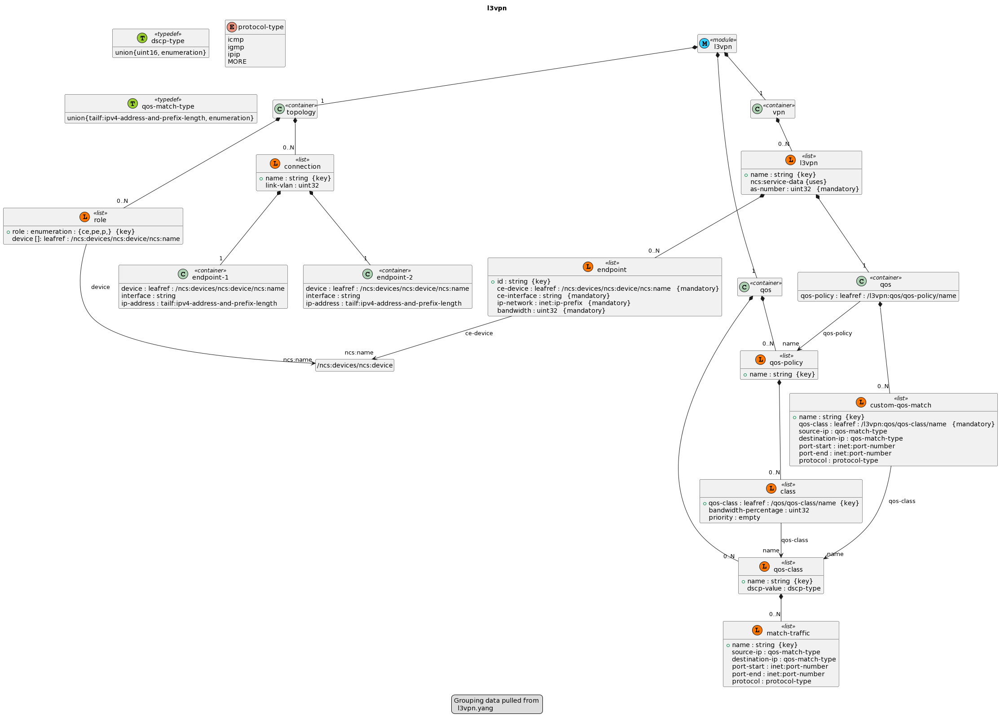

# NCS-UML

[](https://opensource.org/license/apache-2-0/)
[](https://pepy.tech/project/ncs-uml)
[](https://github.com/kirankotari/ncs-uml/issues)

- [Introduction](#introduction)
- [Commands](#commands)
- [Documentation](#docs)
- [Pre-requisites](#pre-requisites)
- [Installation and Downloads](#installation-and-downloads)
- [FAQ](#faq)
- [Bug Tracker and Support](#bug-tracker-and-support)
- [License and Copyright](#license-and-copyright)
- [Author and Thanks](#author-and-thanks)

## Introduction

A Python library and CLI tool that generates plantUML code from the given input YANG Model file. It grabs the dependencies yang models from the Makefile and from NCS. 

To generate a png image or a svg file, install plantUML plugin for VSCode or other editors. plantUML has the web editor available at [plantuml.com](http://www.plantuml.com/)

## Commands

```sh
Usage: ncs-uml [options] [<filename>...]

Creates plantUML file for the YANG module in <filename>, and all its dependencies.
It can be converted into PNG/SVG images using www.plantuml.com or with editor plugins.

Options:
  -h, --help            Show this help message and exit
  -v, --version         Show version number and exit
  -V, --verbose
  --no-inline-groupings
  --dependent-yang-paths=DEPENDENT_YANG_PATHS
                        dependent yang module paths
  --no-inline-groupings-from=NO_INLINE_GROUPINGS_FROM
                        Skips given modules from inline groupings.  Example
                        --uml-no-inline-groupings-from=ietf-yang-push
  --add-legend          Adds legend about grouping yang file in the UML
```

## Docs

**How to use ncs-uml?**

- Command Line  
  Type `ncs-uml <YangFile>`. For more help type `ncs-uml --help`

```shell
user$ ncs-uml $NCS_DIR/examples.ncs/getting-started/developing-with-ncs/17-mpls-vpn-python/packages/l3vpn/src/yang/l3vpn.yang --no-inline-groupings-from=tailf-ncs --add-legend
 INFO |   main | uml file: l3vpn.uml
 INFO |   main | uml clean up done.
user$
```

It returns plantUML code, which can easily converted to image.



Plant UML code:


## Pre-requisites

ncs-uml supports both trains of **python** `2.7+ and 3.1+`, the OS should not matter.

- pyang is used to translate the data.

## Installation and Downloads

The best way to get ncs-uml is with setuptools or pip. If you already have setuptools, you can install as usual:

`python -m pip install ncs-uml`

Otherwise download it from PyPi, extract it and run the `setup.py` script

`python setup.py install`

If you're Interested in the source, you can always pull from the github repo:

- From github `git clone https://github.com/kirankotari/ncs-uml.git`

## FAQ

- **Question:** Can we create uml diagram for the yang sub-module?  
 **Answer:** No, currently we are allowing modules only, we are going to add sub-modules to the module before generating uml diagram

- **Question:** Can I create uml diagram for 2 files at at time?  
 **Answer:** No, currently we are allowing one file at a time.

## Bug Tracker and Support

- Please report any suggestions, bug reports, or annoyances with pingping through the [Github bug tracker](https://github.com/kirankotari/ncs-uml/issues).


## License and Copyright

- ncs-uml is licensed [Apache 2.0](https://opensource.org/license/apache-2-0/) *2023*

   [](https://opensource.org/license/apache-2-0/)

## Author and Thanks

ncs-uml was developed by [Kiran Kumar Kotari](https://github.com/kirankotari)